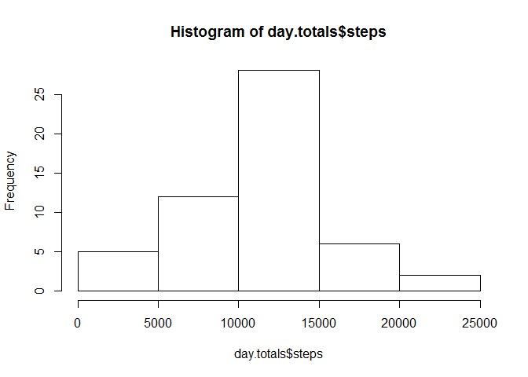
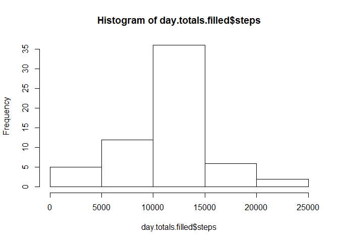
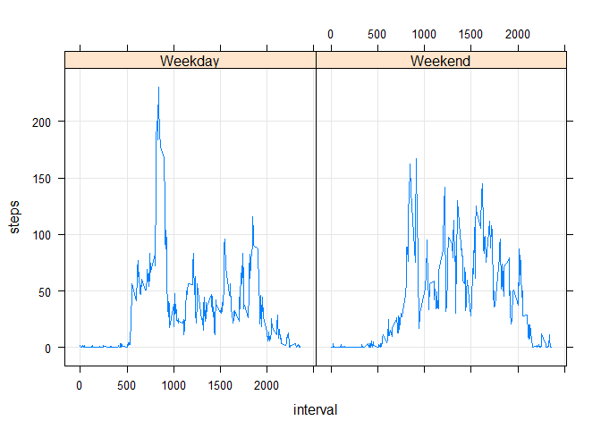

# Reproducible Research: Peer Assessment 1


## Loading and preprocessing the data


```r
activity.zip.path <- "activity.zip"
setInternet2(TRUE)
download.file("https://d396qusza40orc.cloudfront.net/repdata%2Fdata%2Factivity.zip", activity.zip.path, method = "internal")
unzip(activity.zip.path)
input.data <- read.csv("activity.csv")
input.data$date <- as.Date(input.data$date)
```

## What is mean total number of steps taken per day?

```r
day.totals <- aggregate(steps ~ date, input.data, sum, na.action = na.omit)
hist(day.totals$steps)
```

 

```r
daily.mean <- mean(day.totals$steps, na.rm = TRUE)
daily.median <- median(day.totals$steps, na.rm = TRUE)
```

Mean total number of steps per day = 1.0766189\times 10^{4}  
Median total number of steps per day = 10765

## What is the average daily activity pattern?


```r
# Calculate mean steps by interval
interval.means <- aggregate(steps ~ interval, input.data, mean, na.action = na.omit)

# A simple plot to show how mean steps varies by interval
with(interval.means, plot(interval, steps, type = "l"))
```

 

```r
# When is the maximum mean steps?
max.index <- which(interval.means$steps == max(interval.means$steps))
max.interval <- interval.means$interval[max.index]
max.steps <- interval.means$steps[max.index]
```

The interval which has on average across all days the maximum number of steps is interval 835. The mean number of steps for this interval is 206.1698113.

## Inputing missing values


```r
total.na.count <- nrow(input.data[is.na(input.data$steps),])
```

The total number of rows with NA steps is 2304


```r
# Take a copy of the input data to modify
input.data.filled <- input.data

# Fill in the missing step measurements using the mean for the given interval.
na.index <- is.na(input.data$steps)
input.data.filled[na.index, ]$steps <- interval.means[match(input.data[na.index,]$interval, interval.means$interval), ]$steps

# Calculate daily totals using filled data
day.totals.filled <- aggregate(steps ~ date, input.data.filled, sum, na.action = na.omit)

# Histogram of daily totals using filled data
hist(day.totals.filled$steps)
```

 

```r
daily.mean.filled <- mean(day.totals.filled$steps, na.rm = TRUE)
daily.median.filled <- median(day.totals.filled$steps, na.rm = TRUE)
```

Using the filled data (where missing steps are set to the average number of steps for the given interval):  
Mean total number of steps per day = 1.0766189\times 10^{4} (c.f. 1.0766189\times 10^{4} for unfilled data)  
Median total number of steps per day = 1.0766189\times 10^{4} (c.f. 10765 for unfilled data)  
  
We can see that filling in missing observations in this way slightly increases the median, but does not affect the mean (as is expected).

## Are there differences in activity patterns between weekdays and weekends?


```r
# Add a weekday/weekend factor to the filled data
input.data.filled$day.type <- as.factor(ifelse(weekdays(input.data.filled$date) %in% c("Saturday", "Sunday"), "Weekend", "Weekday"))

# Calculate interval means using the filled data
day.type.means <- aggregate(steps ~ day.type + interval, input.data.filled, mean, na.action = na.omit)

# A plot which shows the different in the step profile between weekends and weekdays
library(lattice)
xyplot(steps ~ interval | day.type, day.type.means, type = c('g','l'))
```

 
